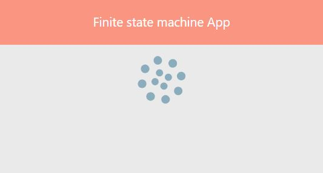

# Finite state machine App

## Demo
Open [Demo](https://konolga.github.io/finite-state-machine/) to view it in the browser.

## Screenshots
#### Loading state representation:

#### Error state representation:

#### Success state representation:

## Available Scripts

In the project directory, you can run:

### `npm start`

Runs the app in the development mode.
Open [http://localhost:4200](http://localhost:4200) to view it in the browser.

### `npx json-server --watch db.json`

To run mock json server. Open [http://localhost:3000](http://localhost:3000) to view it in the browser.

### `npm test`

Launches the test runner in the interactive watch mode.